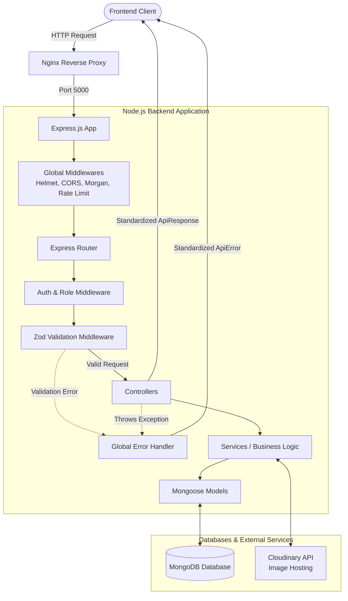

# Teaching Backend API

A production-ready, reusable REST API built with **Node.js**, **Express.js**, **MongoDB**, and **Mongoose**, designed to serve as the backend foundation for multiple frontend projects and educational demonstrations.

Rather than creating a new backend for every project, this API is built once and reused across React, Next.js, admin dashboards, authentication systems, CRUD applications, e-commerce stores, blogs, and data-driven applications.

## 🚀 Project Vision

Build once. Reuse forever.

This backend is designed to become a permanent teaching platform that demonstrates modern backend architecture, scalable project organization, and production-ready development practices.

## 🎯 Primary Goals

- Build a clean, scalable backend architecture
- Follow industry-standard folder structures
- Teach real-world backend development
- Provide reusable APIs for frontend projects
- Demonstrate production-ready best practices
- Deploy on a DigitalOcean VPS for live usage

## 🛠 Tech Stack

- Node.js
- Express.js
- MongoDB
- Mongoose
- JWT Authentication
- Zod Validation
- Cloudinary
- Swagger API Documentation
- PM2
- Nginx
- DigitalOcean VPS

## 📦 Modules

- Authentication
- Users
- Products
- Categories
- Orders
- Blog Posts
- Comments
- Image Uploads
- Statistics Dashboard
- Database Seeders
- Swagger Documentation

## 🎓 Perfect For

- React.js
- Next.js
- React Query
- Redux Toolkit
- Admin Dashboards
- Authentication Systems
- CRUD Applications
- E-commerce Projects
- Blog & CMS Applications
- SSR / SSG Demonstrations
- API Consumption Practice

## ✨ Features

- RESTful API Architecture
- JWT Authentication
- Role-Based Authorization
- Request Validation with Zod
- Global Error Handling
- Standardized API Responses
- Pagination
- Searching
- Filtering
- Sorting
- Cloudinary Image Uploads
- API Documentation with Swagger
- Database Seeder System
- Production-Ready Deployment
- Security Best Practices

## 🌐 Deployment

Hosted on a DigitalOcean VPS

**API Domain**

```
https://api.skramizraza.tech
```

## 🗺 API Routes Map (RESTful)

### Authentication
- `POST /api/v1/auth/register` - Register a new user
- `POST /api/v1/auth/login` - Authenticate user
- `GET /api/v1/auth/me` - Get current authenticated user profile
- `POST /api/v1/auth/logout` - Invalidate session

### Users
- `GET /api/v1/users` - Get all users (Admin)
- `GET /api/v1/users/:id` - Get single user
- `PATCH /api/v1/users/:id` - Update user details
- `DELETE /api/v1/users/:id` - Delete user

### Products
- `GET /api/v1/products` - List products (w/ pagination, filtering, sorting, search)
- `GET /api/v1/products/:id` - Get single product
- `POST /api/v1/products` - Create product
- `PATCH /api/v1/products/:id` - Update product
- `DELETE /api/v1/products/:id` - Delete product

### Categories
- `GET /api/v1/categories` - List categories
- `POST /api/v1/categories` - Create category
- `PATCH /api/v1/categories/:id` - Update category
- `DELETE /api/v1/categories/:id` - Delete category

### Orders
- `GET /api/v1/orders` - List orders
- `GET /api/v1/orders/:id` - Get order details
- `POST /api/v1/orders` - Create order
- `PATCH /api/v1/orders/:id` - Update order status

### Blog (Posts)
- `GET /api/v1/posts` - List posts
- `GET /api/v1/posts/:id` - Get single post
- `POST /api/v1/posts` - Create post
- `PATCH /api/v1/posts/:id` - Update post
- `DELETE /api/v1/posts/:id` - Delete post

### Comments
- `GET /api/v1/comments` - List comments (filtered by post/product)
- `POST /api/v1/comments` - Add comment
- `DELETE /api/v1/comments/:id` - Delete comment

### Uploads (Cloudinary)
- `POST /api/v1/upload/image` - Upload image to external storage
- `DELETE /api/v1/upload/:id` - Remove image

### Statistics
- `GET /api/v1/stats` - Get aggregated dashboard metrics (users, products, orders counts)

## 📏 Naming Conventions & Code Style

- **Architecture & Directories:** Feature-Based Modular Monolith. Domain modules live in `src/modules/` (e.g., `src/modules/users`). Application-wide configurations and logic live in `src/config/` and `src/core/`.
- **Files (Domain specific):** `[entity].[type].js` notation (e.g., `user.controller.js`, `user.model.js`, `user.validator.js`, `auth.routes.js`).
- **Variables & Functions:** `camelCase` (e.g., `getUserById`, `isAuthenticated`).
- **Classes & Models:** `PascalCase` (e.g., `User`, `ApiError`, `ApiResponse`).
- **Constants & ENV:** `UPPER_SNAKE_CASE` (e.g., `JWT_SECRET`, `MONGO_URI`, `PORT`).
- **Database Collections:** `lowercase`, pluralized (e.g., `users`, `products`, `orders`).
- **API Endpoints:** Plural nouns, `kebab-case` if multiple words (e.g., `/api/v1/blog-posts`).

## 🏗 Architecture Diagram



---

This project is developed as a long-term reusable backend platform for full-stack development and teaching, ensuring every future frontend project can connect to a single, consistent, production-ready API.